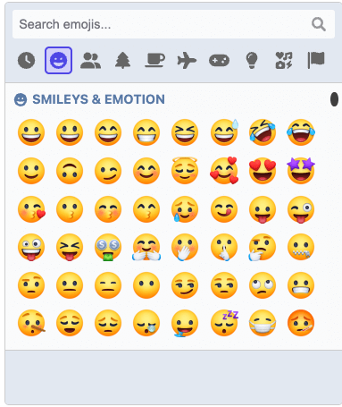

# picmo-facebook-emoji-renderer

Adds support to PicMo for rendering emojis from Facebook instead of native platform emojis.

Requires the [base PicMo package](https://github.com/joeattardi/picmo/tree/main/packages/picmo) to be installed as a peer dependency.




## Installation

```
npm install picmo-facebook-emoji-renderer
```

## Basic usage

```javascript
import { createPicker } from "picmo";
import { useFacebookEmoji } from "picmo-facebook-emoji-renderer";

(async () => {
  const { emojiData, messages, FacebookEmojiRender } = await useFacebookEmoji({
    version: "14.0.0",
    locale: "en",
  });

  const picker = createPicker({
    rootElement: document.body,
    locale: "en",

    //  The following parameters must be passed in before rendering
    renderer: FacebookEmojiRender,
    emojiData: emojiData,
    messages: messages,
  });
})();
```
